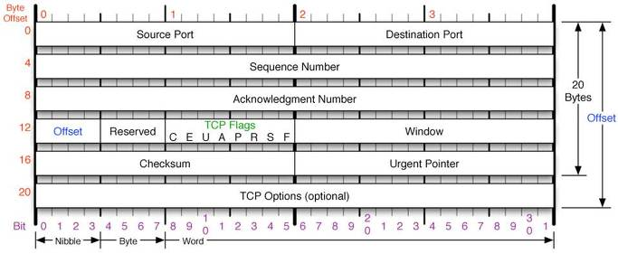

# TCP
  
  
  전송계층 프로토콜 중 하나. IP 프로토콜이 데이터를 전달한다면 TCP는 데이터의 전송을 담당한다.
  
  ## TCP 특징
  
  - 연결지향 프로토콜로, 중간에 데이터가 소멸되지 않고 목적지로 전송된다.
  - 연결지향이기 때문에, 연결을 확립하는 과정이 필요하다. (연결 확립은 3-WAY HANDSHAKE, 종료는 4-WAY HANDSHAKE)
  - 흐름제어와 혼잡제어 제공
  - 이러한 흐름제어(연결 확립과 종료과정 등) 덕분에 UDP보다 느리다.
  - 전송 순서대로 데이터가 수신된다. (Sequence Number의 역할이다.)
  - 전송되는 데이터의 경계가 존재하지 않는다.
    (ex. 송신자가 100 byte 10개를 나누어 보내도 수신자는 한번의 read로 데이터를 전부 읽을 수 있다.
  
  
  ## TCP 헤더
  
  
  
  
  
# UDP

  전송계층 프로토콜 중 하나. TCP와는 다르게 비연결형이다.
  
  
  ## UDP 특징
  
  - 비연결지향 프로토콜로, 중간에 데이터가 소멸될 수 있다. 따라서 신뢰성이 떨어진다.
  - 연결 확립 및 종료같은 흐름제어가 존재하지 않아 TCP보다 빠르다.
  - 데이터그램 단위로 전송. (65535byte 단위)
  - 체크섬 필드를 이용하여 최소한의 에러만 검출한다.
  - 정보 유실에 민감하지 않은 실시간 스트리밍에 적합하다.
  
  
  ## UDP 헤더
  
  

  
